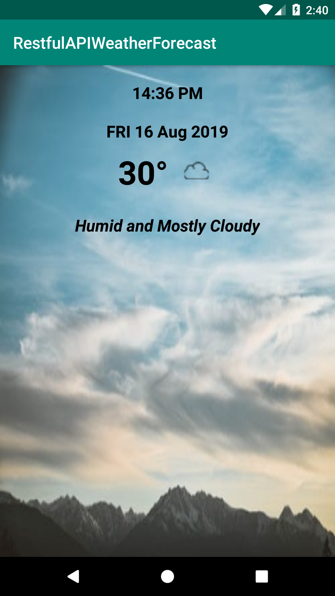

# WeatherForecastApplication
An android application for weather forecast using Restful API and third party API for weather information.

**Third party libraries used:**
   
   * [Retrofit](https://square.github.io/retrofit/)
   * [Eventbus](https://github.com/greenrobot/EventBus)
   * [Butterknife](https://github.com/JakeWharton/butterknife)

**Third party API used:**
  
  * [Dark Sky API](https://darksky.net/dev)

**Here is the screenshot:**

